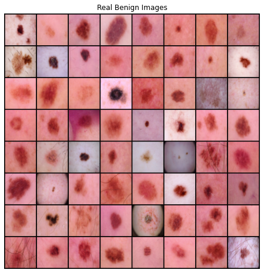
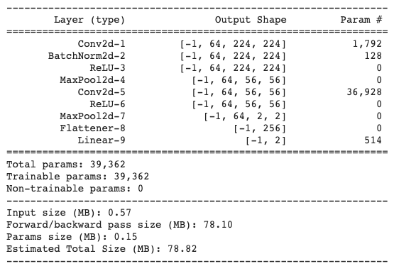
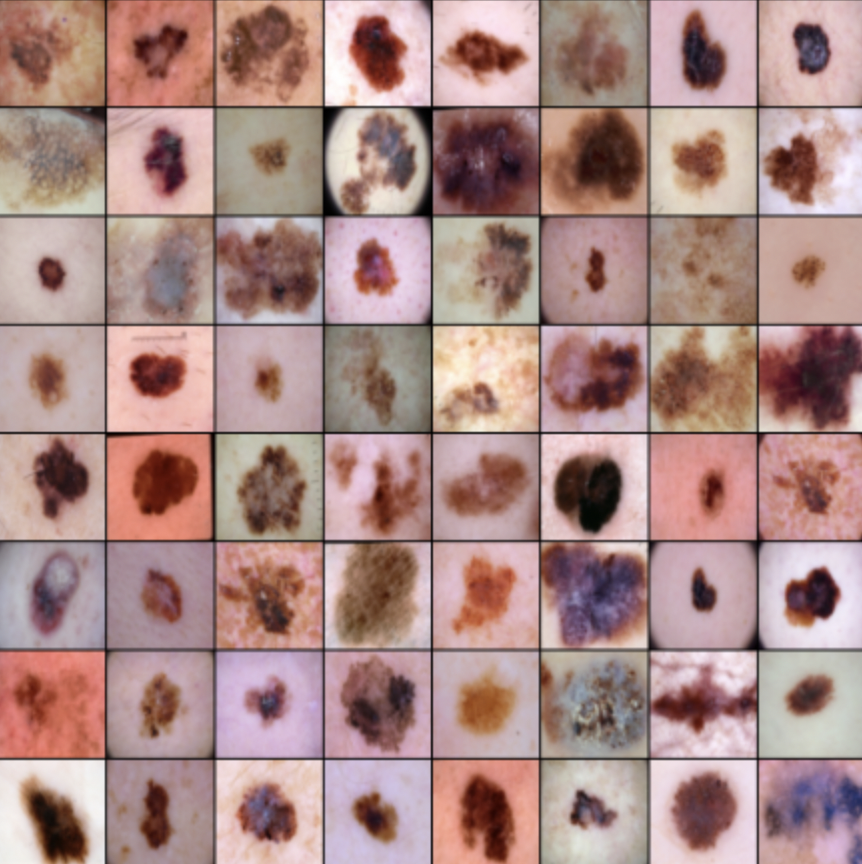
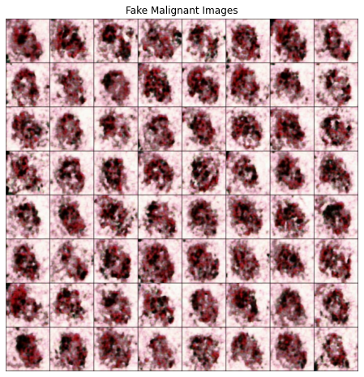
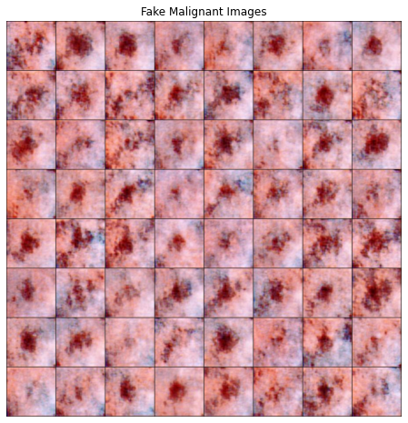
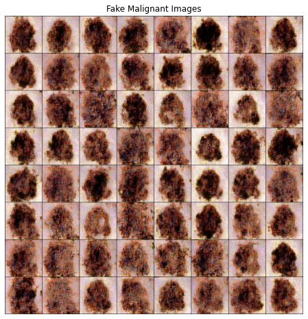
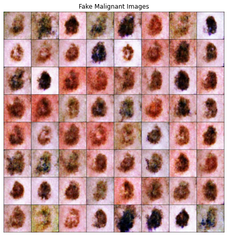
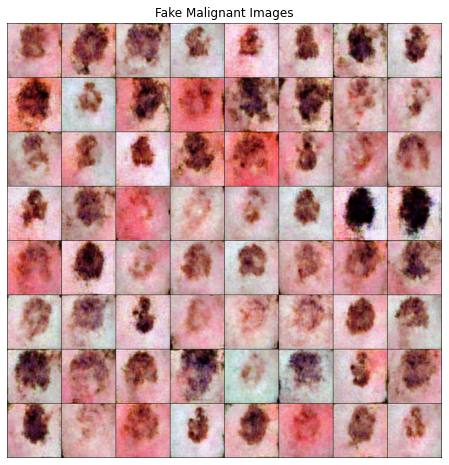
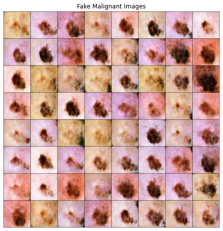
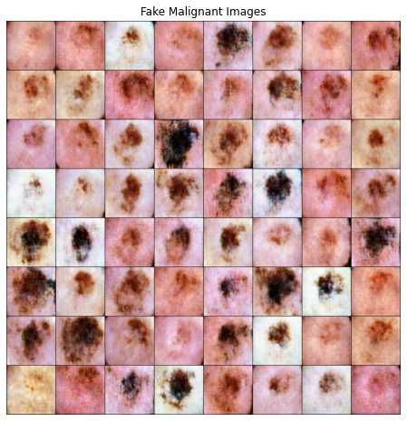

# GAN Augmentation to improve Classification Performance

## Issue

의료 분야의 특성 상 데이터 개방성이 낮고 절대적인 데이터의 수가 부족하다. 의료 데이터는 특유의 민감성 때문에 반드시 연구에 필요한 최소 수준의 데이터 요청 및 폐쇄된 환경에서만 활용이 가능해 데이터 접근이 매우 제한적이다. 양질의 데이터를 확보하는 데에도 한계가 있다. 질병의 특성 때문에 데이터 자체가 희귀하거나 데이터가 특정 그룹에 편향되어 있어 데이터 불균형 문제가 발생한다. 예시로 질병으로 분류(Classification)되는 데이터는 전체 데이터의 극히 일부만을 차지한다.

의료 데이터의 정제와 가공 또한 많은 비용과 전문 인력 투입이 필요하므로 어려움을 겪는다. 의료 데이터는 전문적인 영역으로, Labeling 하기 위해서는 의료 전문가의 협력이 필수적이다. 하지만 전문적인 인력을 Labeling과 같은 단순 작업에 이용하는 것은 산업 구조에서 비효율성을 초래한다.

이러한 의료 데이터의 문제를 해결하기 위해 의료 데이터의 수를 늘리기에 적합한 Generative Adverarial Network (GAN)을 탐구하고, 합성 의료 데이터를 생성하여 Data Augmentation을 진행한다.

합성 데이터란 "직접 확보하지 못하는 특정 환경에 적용할 수 있는 모든 데이터"를 뜻한다. 합성 의료 데이터 생성 기술을 통해 실제와 유사한 가짜 의료 데이터를 생성함으로써 의료 데이터 부족 문제를 해결할 수 있다. 이는 소량의 원(original) 데이터로 빠르고 저렴하게 합성 의료 데이터를 생성할 수 있다는 장점이 있다. 더불어 데이터 라벨링 작업을 위한 시간과 비용을 절감할 수 있으며 민감 정보를 포함하고 있는 실제 의료 데이터를 대체할 수 있다.

본 연구는 절대적으로 부족한 의료 데이터에 여러 GAN을 적용하여 Data Augmentation을 진행한다. 이를 통해 의료 데이터 분류(Classification) 모델의 성능을 향상 시키고자 한다. 더 나아가 의료 데이터와 같은 특성을 가진 유사 분야에 본 연구 방식을 적용하여 문제를 해결할 수 있다.

## Dataset

본 연구에서 사용한 데이터셋은 Kaggle의 Skin Cancer Image 데이터로 benign(양성)과 malignant(악성) 종양 image 이진 분류를 목적으로 사용되는 데이터셋이다.  

Real Benign Image 샘플

Real malignant Image 샘플

<aside>
📎 Image size: 224 x 224
Training data: Benign (1440장), Malignant(1197장)
Test data: Benign (360장), Malignant (300장)

</aside>

## Experiment Environment

### S**cenario**

1. 소량의 Malignant image dataset과 다량의 Benign image dataset이 있는 상황
2. 여러 GAN을 활용하여 Malignant fake image dataset를 생성하여 Class Imbalance 해결
3. 분류 성능 측정의 기준이 되는 모델 (간단한 Pytorch CNN 모델)로 성능 테스트

### Setting

본 연구에서는 총 4 종류의 GAN 모델을 활용하여 소량의 real malignant image 개수의 수준(10, 50, 100, 200, 500개)에 따라 기준이 되는 Classification Model에서 학습되어지는 real malignant image의 개수(1197개)에 맞춰 Data Augmentation을 통해 1197개를 맞춰준다.

이를 통해 GAN Model 종류 별로 Real Image와 Fake Image의 비율이 어느 정도 수준에서 기준이 되는 Classification Model의 정확도에 가까워지는지 실험해본다.

- Output Image size 설명
    - 224 x 224
- 기준 Classification Model 설명

    Pytorch 기반의 간단한 CNN 분류 모델로 구성하였다.

    - Model Summary

        

    - Loss function : CrossEntropyLoss
    - Optimizer : Adam
    - Loss / Accuracy Plot

        

## 4) GAN Augmentation

### InfoGAN

1. Number of training Images : 10, 50, 100, 200, 500
2. Batch_size : 8, 16, 64, 128, 128
3. Epoch : 1000, 1500, 2000, 3000, 3500
4. Output image size : 112 x 112 → 224 x 224 (ESRGAN super-resolution model을 활용하여 확대)
5. Training Time : 4분 ~ 2시간 (Colab 환경)

real malignant images

training 10 real malignant images

training 50 real malignant images

training 100 real malignant images

training 200 real malignant images

training 250 real malignant images

training 300 real malignant images

training 500 real malignant images

## InfoGAN Result

InfoGAN의 경우, original gan과 다른게 이산적이거나 연속적인 latent c값에 따라 image를 생성할 수 있다. 하지만, malignant 하나의 클래스로 augmentation했다는 점과 malignant image 자체에서 어떠한 연속적인 feature가 있는지 일반인은 판단하기 어렵다는 점을 고려하여 적합하지 않음을 알 수 있다. 이미지 화질의 개선이 필요할 뿐만 아니라, 다른 최신 GAN에 비해 성능이 떨어진다.

## Classification Result

- 아래의 표는 본 연구의 실험 결과이다.
- 열의 10, 50, 100, 200, 250, 300, 500, All images은 학습에 사용된 real image 개수이다.
- 행의 'Base (only Real)'는 class imbalance일 경우, real image 만을 사용하였다.
- 행의 'GAN (w. Fake)'는 class imbalance를 해결하기 위해 각각의 GAN으로 fake image를 생성하였다.
- 빈 칸의 값은 각각 'Accuracy' / 'AUC' 값을 나타낸다.

| Model / Real data | 10 images | 50 images | 100 images | 200 images | 250 images | 300 images | 500 images | All images |
| --- | --- | --- | --- | --- | --- | --- | --- | --- |
| Base (only Real) | 0.55 / 0.50 | 0.58/ 0.54 | 0.54 / 0.50 | 0.62 / 0.59 | 0.68 / 0.65 | 0.73 / 0.71 | 0.81 / 0.81 | 0.83 / 0.83 |
| InfoGAN (w. Fake) | 0.54 / 0.49 | 0.58 / 0.54 | 0.59 / 0.55 | 0.69 / 0.66 | 0.70 / 0.67 | 0.67 / 0.64 | 0.79 / 0.77 | - |

---

## Reference

[ Dataset ] : [https://www.kaggle.com/fanconic/skin-cancer-malignant-vs-benign](https://www.kaggle.com/fanconic/skin-cancer-malignant-vs-benign)

[ classification model ] : [https://www.kaggle.com/puff1n/classification-with-pytorch-85acc](https://www.kaggle.com/puff1n/classification-with-pytorch-85acc)
